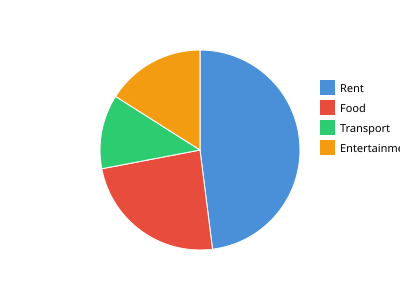

# Etch Examples

This file demonstrates how to use Etch to create charts.

## Bar Chart

### Temperature Data

```etch
%temperatures = [
  {"city":"NYC","temp":72},
  {"city":"LA","temp":85},
  {"city":"Miami","temp":91},
  {"city":"Denver","temp":65},
  {"city":"Seattle","temp":58}
]
%chartbar : %temperatures.city = %temperatures.temp
```

**Render:**
```bash
python -m etch render temperature.etch -o temperature.svg
```


## Pie Chart

### Budget Breakdown

```etch
%budget = [
  {"category":"Rent","amount":1200},
  {"category":"Food","amount":600},
  {"category":"Transport","amount":300},
  {"category":"Entertainment","amount":400}
]
%chartpie : %budget.category = %budget.amount
```

**Render:**
```bash
python -m etch render budget.etch -o budget.svg
```



## More Examples

Run these to see more charts:

```bash
# Bar chart
python -m etch render example.etch -o example.svg

# Pie chart  
python -m etch render pie.etch -o pie.svg
```
