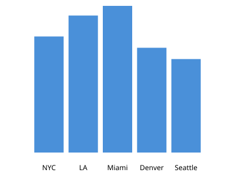

# Etch Examples

This file demonstrates how to use Etch to create charts.

## Bar Chart (Static SVG)

```etch
%temperatures = [
  {"city":"NYC","temp":72},
  {"city":"LA","temp":85},
  {"city":"Miami","temp":91},
  {"city":"Denver","temp":65},
  {"city":"Seattle","temp":58}
]
%chartbar : %temperatures.city = %temperatures.temp
```

**Render to SVG:**
```bash
python -m etch render test.etch -o test.svg
```



## Interactive HTML (Chart.js)

Generate interactive HTML with hovering, tooltips, and animations:

```bash
# Interactive bar chart
python -m etch interactive test.etch -o test.html

# Interactive pie chart
python -m etch interactive pie.etch -o pie.html

# Combined bar + pie
python -m etch interactive combined.etch -o combined.html
```

Open the HTML file in a browser to see interactive charts! Features:
- Hover for tooltips with values
- Click legend to toggle data
- Smooth animations

## Commands

| Command | Output | Description |
|---------|--------|-------------|
| `python -m etch render input.etch -o output.svg` | SVG | Static chart |
| `python -m etch interactive input.etch -o output.html` | HTML | Interactive chart |
